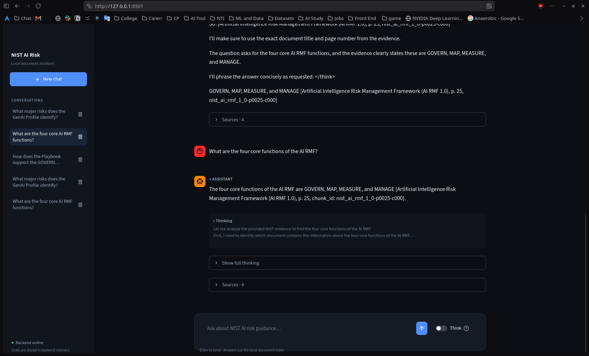

# NIST AI Risk Assistant

A local RAG chat application that answers questions about NIST AI risk guidance using your own language model. Ask a question, follow the streamed answer, and check the supporting document pages.



## 1. What data does it use?

The assistant searches three English-language NIST publications, covering **259 pages**:

| Document | What it covers |
|---|---|
| AI Risk Management Framework (AI RMF 1.0) | The GOVERN, MAP, MEASURE, and MANAGE functions for managing AI risk. |
| Generative AI Profile | Risks and recommended actions specific to generative AI. |
| AI RMF Playbook | Practical guidance for implementing the framework. |

The PDFs are included in [data/raw/](data/raw/). See the [dataset description](data/Dataset.md) and [source manifest](data/metadata/sources.json) for provenance and file checksums.

A prepared **Chroma vector index with 447 text chunks** is also included in [backend/data/vector_store/](backend/data/vector_store/). You do not need to download the PDFs again, run the notebook, or rebuild the index to use the app. Adding your own PDFs is not currently a UI feature.

## 2. How RAG works with the local LLM

Retrieval-Augmented Generation (RAG) gives a language model relevant document passages before it writes an answer. The model is not trained or fine-tuned on these PDFs.

The preparation pipeline splits PDF pages into chunks of 450 tokens with an 80-token overlap. **all-MiniLM-L6-v2** converts each chunk into a numerical representation (an embedding), which is stored in **ChromaDB** alongside its document title, page, and source URL.

When you ask a question:

1. The **Streamlit frontend** sends it to the **FastAPI backend**.
2. MiniLM embeds the question on the CPU.
3. Chroma retrieves the four most similar passages.
4. The backend sends those passages, your question, and limited recent chat history to **qwen3:4b**, running locally through **Ollama**.
5. The answer streams back to the chat, with source references you can inspect.

```text
Your browser
    │
    ▼
Streamlit chat · port 8501
    │
    ▼
FastAPI backend · port 8000
    ├── MiniLM → Chroma → relevant document passages
    └── Ollama · port 11434 → qwen3:4b → streamed answer
```

Model inference runs locally; no cloud inference API key is required. Internet access is needed initially to install dependencies and download the models. After that, answering questions uses local resources.

The interface includes conversation history, expandable sources, optional **Think** mode, and light/dark themes. Conversation history is held in backend memory and disappears when the backend restarts.

## 3. Project structure

```text
RAG-Powered-Document-Assistant/
├── backend/
│   ├── app/                 FastAPI endpoints, retrieval, generation, and chat history
│   ├── data/vector_store/   Prepared Chroma index and pipeline configuration
│   ├── scripts/             Live backend smoke test
│   ├── tests/               Backend tests
│   └── .env.example         Backend configuration template
├── frontend/
│   ├── app.py               Streamlit chat application
│   ├── components.py        Chat messages, thinking, and source displays
│   ├── styles.py            Responsive layout and light/dark themes
│   ├── api_client.py        Communication with the backend
│   └── .env.example         Frontend configuration template
├── data/
│   ├── raw/                 The three NIST PDFs
│   ├── metadata/            Source provenance and checksums
│   └── evaluation_*         Evaluation questions and saved results
├── notebooks/               RAG preparation and evaluation notebook
├── screenshots/             Application screenshots
└── reports/                 Implementation and evaluation notes
```

Start with the application setup below. The notebook is for exploring how the data pipeline was built; it is not part of normal startup.

## 4. Install and run

### Prerequisites

- Git and Python 3.10 or newer.
- [Ollama](https://ollama.com/) installed on the machine that will run the model.
- Available memory and disk space for the Python dependencies and `qwen3:4b`. Generation speed depends on your hardware; CPU generation can take minutes.

Run the commands from the repository root. Keep the backend and frontend in the same Python virtual environment.

### Step 1 — Clone the repository

```bash
git clone https://github.com/Gamal-Asran/RAG-Powered-Document-Assistant.git
cd RAG-Powered-Document-Assistant
```

### Step 2 — Create a virtual environment

**Linux / macOS:**

```bash
python3 -m venv .venv
source .venv/bin/activate
```

**Windows PowerShell:**

```powershell
py -m venv .venv
.venv\Scripts\Activate.ps1
```

Install the dependencies on either platform:

```bash
python -m pip install --upgrade pip
python -m pip install -r backend/requirements.txt -r frontend/requirements.txt
```

### Step 3 — Create the configuration files

**Linux / macOS:**

```bash
cp backend/.env.example backend/.env
cp frontend/.env.example frontend/.env
```

**Windows PowerShell:**

```powershell
Copy-Item backend/.env.example backend/.env
Copy-Item frontend/.env.example frontend/.env
```

The defaults work when Ollama, the backend, and the frontend run on the same machine. No API keys are needed.

### Step 4 — Download the models once

Start the Ollama application or, in a separate terminal, run:

```bash
ollama serve
```

If Ollama is already running as a service, leave it running and skip this command.

In your activated virtual environment, download the generation model and cache the embedding model:

```bash
ollama pull qwen3:4b
python -c "from sentence_transformers import SentenceTransformer; SentenceTransformer('sentence-transformers/all-MiniLM-L6-v2', device='cpu')"
```

Use the same operating-system account for this download and for running the backend. The backend loads the embedding model from the local cache in offline-only mode, so this download must finish before startup.

### Step 5 — Start the backend

Open a terminal in the repository root and activate `.venv` using the command for your platform from Step 2. Then run:

```bash
python -m uvicorn backend.app.main:app --host 127.0.0.1 --port 8000
```

Wait for `Application startup complete`. Open [the health endpoint](http://127.0.0.1:8000/health) in your browser. A ready backend reports:

```json
{
  "status": "healthy",
  "ollama": "available",
  "ollama_model": "qwen3:4b",
  "embedding_device": "cpu",
  "chroma_collection": "nist_ai_risk_corpus",
  "chroma_count": 447
}
```

Leave this terminal running.

### Step 6 — Start the frontend

Open another terminal in the repository root, activate `.venv`, and run:

```bash
python -m streamlit run frontend/app.py --server.address 127.0.0.1 --server.port 8501
```

Open **[http://localhost:8501](http://localhost:8501)** and ask:

> What are the four core functions of the AI RMF?

Keep **Think** disabled for your first question. Expand **Sources** to inspect the retrieved passages and document links. Use **Appearance** in the sidebar to switch themes.

To stop the app, press `Ctrl+C` in the frontend and backend terminals. On later runs, you only need Ollama running and Steps 5–6; you do not need to reinstall packages or download the models again.

### Run on a remote machine

For a personal server, follow the same setup on that machine, including downloading both models there. Run all three services there using the localhost addresses above, then forward the frontend port from your own computer:

```bash
ssh -N -L 8501:127.0.0.1:8501 your-user@your-server
```

Open **http://localhost:8501** on your computer while the tunnel and server processes are running.

This is a manual deployment: the processes must stay running. The repository does not provide a working Docker deployment or service manager configuration. The app also has no user authentication or per-user conversation isolation, so it is intended for personal use rather than public multi-user hosting.

## Configuration

Edit `backend/.env` or `frontend/.env`, then restart the corresponding service. See the [backend template](backend/.env.example) and [frontend template](frontend/.env.example) for all settings.

| File | Setting | Default / purpose |
|---|---|---|
| Backend | `OLLAMA_HOST` | `http://127.0.0.1:11434` — Ollama address |
| Backend | `OLLAMA_MODEL` | `qwen3:4b` — installed generation model |
| Backend | `OLLAMA_CONTEXT` | `4096` — context window |
| Backend | `OLLAMA_NUM_PREDICT` | `1024` — generation token budget |
| Backend | `RETRIEVAL_TOP_K` | `4` — passages retrieved per question |
| Backend | `MAX_HISTORY_EXCHANGES` | `2` — recent exchanges included in the prompt |
| Frontend | `API_BASE_URL` | `http://127.0.0.1:8000` — backend address |
| Frontend | `QUERY_TIMEOUT_SECONDS` | `300` — request timeout in seconds |

Keep the default embedding model, collection, and vector-store settings when using the bundled index. The backend validates them against its saved pipeline configuration; changing the embedding model alone will not rebuild the index.

## Troubleshooting

| Problem | What to check |
|---|---|
| Backend cannot load the embedding model | Complete the MiniLM download in Step 4 using the same account as the backend. |
| Health reports `degraded` or Ollama is unavailable | Start Ollama, run `ollama list`, and confirm `qwen3:4b` is installed. Restart the backend afterward; model availability is checked at startup. |
| Vector-store directory, configuration, or record-count error | Confirm the complete `backend/data/vector_store/` directory came with your clone and keep its default settings. |
| Frontend says the backend is offline | Check the backend terminal and health endpoint; confirm `API_BASE_URL` matches the backend port. |
| Answers are slow or time out | Disable Think mode first. If needed, increase `QUERY_TIMEOUT_SECONDS` in `frontend/.env` and restart the frontend. |
| A port is already in use | Check whether that service is already running. If you change the backend port, update `API_BASE_URL` too. |
| Chats disappeared after a restart | This is expected: conversations are stored in memory, not saved to disk. |

Answers can be incomplete or incorrect even when sources are returned. Check the cited pages; this assistant summarizes NIST guidance and does not provide legal advice. Model generation is serialized, so simultaneous requests wait their turn.

## Development

Interactive API documentation is available at **[http://127.0.0.1:8000/docs](http://127.0.0.1:8000/docs)** while the backend is running.

The API includes `/health`, `/query`, `/query/stream`, and conversation list, read, and delete endpoints. The frontend uses `/query/stream` for incremental answers.

Run the tests from your activated virtual environment:

```bash
python -m pytest backend/tests frontend/tests -q
```

The tests use mocks and do not require Ollama or downloaded models. To check the running backend with real model generation:

```bash
python backend/scripts/smoke_test.py
```

For pipeline experiments, see [notebooks/rag_pipeline.ipynb](notebooks/rag_pipeline.ipynb). For implementation notes, see [reports/](reports/).
